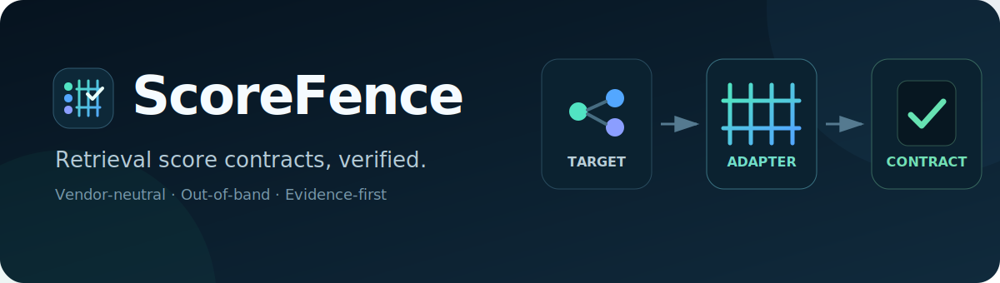
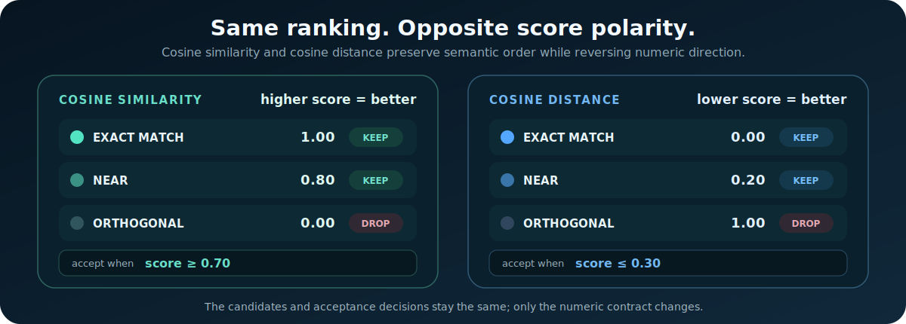
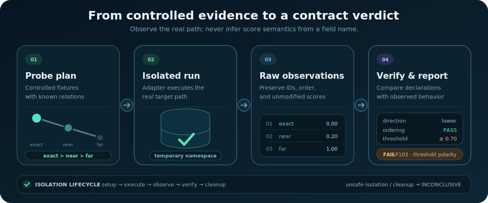

<div align="center">
  
</div>

<p align="center">
  <strong>Contract testing for scores crossing retrieval and ranking system boundaries.</strong>
</p>

> **Project status:** the documentation and MVP contract are ready; the executable CLI has not been implemented yet. Commands below describe the target interface and do not claim an available release.

## The problem in 60 seconds

A vector database returns a number:

```json
{ "document": "refund-policy.md", "score": 0.82 }
```

But the number alone is not enough. `0.82` may mean:

- high similarity — a good result;
- large distance — a poor result;
- transformed relevance with an undocumented range;
- a reranker result that cannot be compared to the original score;
- a value that should be sorted ascending even though the application sorts descending.

As a result, a retrieval pipeline may appear healthy — requests pass, items are returned, and no error is raised — while it silently selects the worst results or discards the best ones.

**ScoreFence creates a small isolated dataset with mathematically known relationships, executes real searches, and validates the effective score contract of the entire path.**

## Where ScoreFence fits

ScoreFence is useful whenever a numeric value leaves the component that produced it and another independently implemented component uses that value to sort, filter, rank, or make a selection. The important condition is not that a response contains a field named `score`; it is that several boundaries may disagree about the field's meaning.

```text
producer → SDK/adapter → service/API → threshold/ranking policy → consumer
```

The current deterministic probe model is a strong fit for systems based on vector distance or similarity:

| Area | Ranked objects | Typical contract failure |
|---|---|---|
| Semantic and document search | documents, passages, tickets, messages | a distance is treated as relevance |
| Product and catalog search | products, categories, offers | a backend change reverses threshold polarity |
| Retrieval-augmented applications | context chunks, memories, tool results | the best context is rejected before generation |
| Recommendation candidate generation | items selected before a ranking model | a candidate adapter reverses nearest-neighbor order |
| Multimodal similarity search | images, audio, video, code | one modality or SDK applies an undocumented transform |
| Entity matching and deduplication | customer, product, or document candidates | unrelated records pass a duplicate threshold |
| Multi-backend search gateways | results from interchangeable targets | identical API fields expose incompatible semantics |
| Search migrations and upgrades | baseline and candidate systems | the schema stays stable while direction or range drifts |

ScoreFence is most valuable at integration boundaries and change points: onboarding a target, replacing an adapter, upgrading an SDK, changing a metric, adding a ranking stage, migrating a backend, or investigating a silent quality regression.

The architecture can later support domain-specific probe packs for rerankers, recommendation models, anomaly scores, or risk scores. Those packs need controlled domain fixtures and their own invariants. The vector-retrieval MVP does **not** claim to validate arbitrary model outputs merely because they are numeric.

See [application areas and end-to-end scenarios](docs/USE_CASES.md) for a detailed fit model and examples.

## End-to-end example: a silent migration regression

Consider a catalog-search service whose original backend returns a distance: an exact match receives `0.00`, a nearby item `0.15`, and an unrelated item `0.95`. Its adapter exposes public relevance as `1 - distance`, and the application accepts results with `score >= 0.75`.

The backend is later replaced by one that already returns higher-is-better similarity. The response schema remains unchanged, so the old adapter continues to calculate `1 - score`:

```text
native similarity   0.98   0.82   0.07
public score        0.02   0.18   0.93
semantic quality    best   near   unrelated
```

Requests still succeed, result lists are non-empty, and schema tests pass. The public API now rejects the best candidates and accepts the worst ones.

ScoreFence runs one probe plan through both boundaries:

```text
direct backend path      exact > near > far   higher_is_better   PASS
consumer-facing API      exact < near < far   lower_is_better    FAIL
configured threshold     rejects exact, accepts far              FAIL
suspected transform      public ≈ 1 - native
```

The result localizes the defect to the integration path before traffic is switched. After the adapter contract is corrected, the same probe becomes a regression test in CI.

<div align="center">
  
</div>

## Why this is not an ordinary evaluation framework

| Quality evaluation | ScoreFence |
|---|---|
| Evaluates answer quality on a question set | Validates the technical contract at the retrieval boundary |
| Often invokes an LLM-as-a-judge | Does not require a generative model |
| Requires a dataset and reference answers | Uses a few synthetic vectors or documents |
| The result may be subjective | Core invariants are mathematically verifiable |
| Searches across many possible causes of a poor answer | Localizes distance, similarity, ordering, and threshold errors |

ScoreFence does not replace golden datasets, relevance benchmarks, or human evaluation. It covers an earlier layer: **whether components correctly understand each other’s numbers at all**.

## How it works

<div align="center">
  
</div>

The basic deterministic probe uses direct vectors:

```text
query       q = ( 1.0, 0.0 )
exact       e = ( 1.0, 0.0 )
near        n = ( 0.8, 0.6 )
orthogonal  o = ( 0.0, 1.0 )
opposite    p = (-1.0, 0.0 )
scaled      s = ( 2.0, 0.0 )
```

For cosine similarity, the expected order is `e/s > n > o > p`. Cosine distance preserves the semantic order but smaller numbers are better. Vector `s` helps distinguish cosine from dot product: its direction matches `q`, but its magnitude differs.

ScoreFence does not guess the backend from its name. It observes actual results and validates:

1. **identity invariant** — an exact match should be among the best results;
2. **monotonicity** — a known closer item must not become worse than a distant one;
3. **sort direction** — output order must follow observed score semantics;
4. **threshold polarity** — `>=` for higher-is-better and `<=` for lower-is-better;
5. **metric fingerprint** — the behavior of scaled and opposite vectors is compatible with the declared metric;
6. **pipeline preservation** — any intermediate API or retrieval consumer does not invert or reinterpret a backend result.

The [theory document](docs/THEORY.md) explains the mathematics, limitations, and potential false conclusions in detail.

## Example detected error

```text
ScoreFence v0.x — retrieval contract report

Target       candidate-search/generic-http
Collection   sf_01J_probe_7f42
Metric       declared: cosine
Value kind   observed: distance
Direction    observed: lower_is_better
Threshold    configured: score >= 0.70

FAIL SF103 — threshold polarity mismatch
  Exact match       score=0.000  rejected
  Near match        score=0.200  rejected
  Orthogonal        score=1.000  accepted

Suggested contract:
  value_kind: distance
  better_when: lower
  threshold:
    operator: lte
    value: 0.30

Confidence: 0.99 (direct-vector deterministic probe)
Cleanup: probe collection deleted
```

Complete examples: the [human-readable report](examples/report.md) and its [JSON form](examples/report.json).

## What the contract contains

```yaml
contract:
  pack: vector_retrieval/v1alpha1
  boundary: consumer_api
  metric: cosine
  value_kind: distance
  better_when: lower
  expected_range: [0.0, 2.0]
  result_order: ascending
  threshold:
    operator: lte
    value: 0.30
  score_stage: vector_search
```

The key idea is that a field named `score` is not a contract. A contract exists only after explicitly defining:

- the metric;
- the value meaning;
- the “better” direction;
- the valid range;
- sorting;
- the threshold operator;
- the stage where the score was produced or transformed.

## Target CLI

After implementation, a typical run will look like this:

```bash
scorefence probe --config scorefence.yaml
```

Validate a predefined contract:

```bash
scorefence validate \
  --target candidate-search \
  --pack vector_retrieval/v1alpha1 \
  --contract contracts/staging.yaml \
  --format terminal,json
```

Compare behavior before and after a backend migration:

```bash
scorefence compare \
  --baseline source-backend \
  --candidate candidate-backend
```

Explain a rule:

```bash
scorefence explain SF103
```

See the [planned configuration example](examples/scorefence.yaml).

## Operating modes

### Contract validation

Compares observed behavior with an explicit contract. This is the primary mode for CI and production onboarding.

### Discovery

When backend documentation is unavailable, cautiously infers the most likely `value_kind` and `better_when`. Discovery must never change production configuration silently.

### Migration comparison

Runs the same probes against the old and new backends and exposes semantic differences before traffic is switched.

### Regression check

Stores a contract fingerprint and validates it after an upgrade to the search backend, SDK, encoder, or retrieval service.

## Probe safety

ScoreFence must never mix test records with user data. A safe implementation must:

- create a separate temporary collection or namespace;
- use a unique prefix and TTL;
- delete probe data in `finally`, including after an error;
- never read or export user documents;
- support `--keep-probe-data` only as an explicit debugging opt-in;
- record the cleanup result in the report;
- return `INCONCLUSIVE` when isolation cannot be guaranteed.

See the [security model](SECURITY.md) for details.

## Architecture

The proposed structure separates four independent extension axes:

```text
Runner: CLI / library / scheduled job
   ↓
Probe pack: fixtures + expected relations + required capabilities
   ↓
Target adapter: direct backend or consumer-facing pipeline
   ↓
Core: observations → inference → contract validation → evidence report
```

The **core** owns contracts, observations, findings, confidence, comparison, and reports. A **probe pack** defines what controlled evidence means for one score family. An **adapter** owns transport and isolated fixture lifecycle but never interprets a score. A **runner** decides where and when validation executes.

The first probe pack is `vector_retrieval`; future packs are separate extensions rather than hidden heuristics in the core. See the [architecture](docs/ARCHITECTURE.md) and [detection model](docs/DETECTION_MODEL.md).

## Universal integration

ScoreFence is a standalone CLI and library core. It requires no specific platform, gateway, vector database, or orchestration layer:

1. An adapter declares target capabilities and the temporary-namespace lifecycle.
2. ScoreFence creates an isolated probe dataset.
3. Search runs either directly or through the same consumer-facing API used by the application.
4. The result is stored as a portable `retrieval contract fingerprint`.
5. The report is available as terminal, JSON, or Markdown output and can be used locally, in CI, from a cron job, or by any control plane.
6. After any component upgrade, the probe runs again and detects drift before users are affected.

The adapter is a plugin boundary: implementations for databases, HTTP APIs, SDKs, and complete retrieval pipelines connect without changes to the inference engine. See the [universal integration patterns](docs/INTEGRATION.md).

## MVP boundaries

The first release includes:

- the `vector_retrieval` probe pack with deterministic direct-vector probes;
- a public vendor-neutral adapter protocol;
- a reference in-memory adapter;
- one generic HTTP adapter configured through field mappings;
- direction, ordering, and threshold-polarity checks;
- `PASS/WARN/FAIL/INCONCLUSIVE`;
- terminal, JSON, and Markdown reports;
- safe cleanup;
- CI exit codes.

The first release **does not include**:

- LLM answer-quality evaluation;
- automatic production-threshold tuning;
- reranker evaluation;
- semantic-text benchmarking;
- a permanent proxy in the data path;
- automatic mutation of vector-store settings;
- universal support for every vector database.

It also does not present arbitrary classifier, risk, anomaly, recommendation, or reranker values as validated vector-score contracts. Supporting those score families requires an explicit probe pack with suitable fixtures and invariants.

These boundaries make an honest, working MVP achievable in one to two weeks.

## Documentation

| Document | Purpose |
|---|---|
| [Theory](docs/THEORY.md) | Detailed explanation of the problem, mathematics, and limitations |
| [Application areas](docs/USE_CASES.md) | Fit criteria, end-to-end scenarios, lifecycle, and non-use cases |
| [Architecture](docs/ARCHITECTURE.md) | Components, data flow, adapters, and deployment model |
| [Detection model](docs/DETECTION_MODEL.md) | Probes, rules, confidence, and verdicts |
| [Universal integration](docs/INTEGRATION.md) | CLI, library, CI, HTTP, and pipeline scenarios |
| [Originality](docs/ORIGINALITY.md) | Adjacent work, differentiation, and novelty boundaries |
| [Roadmap](ROADMAP.md) | Path from the CLI to a product capability |
| [Contributing](CONTRIBUTING.md) | Rules for adding adapters and checks |
| [Security](SECURITY.md) | Isolation, cleanup, and credential handling |

## Why ScoreFence

The name describes the project’s function:

- **Score** — the number crossing the boundary between a search backend and any consumer;
- **Fence** — a verifiable boundary that prevents components from silently agreeing on the wrong semantics.

A targeted search in software and vector-search contexts did not show an obvious existing project with this name. Code-hosting platforms, package registries, and trademark databases still need a separate review before public release.

## License

No license was selected intentionally during the design stage. Before publication, determine IP ownership and approve an appropriate open-source license.
