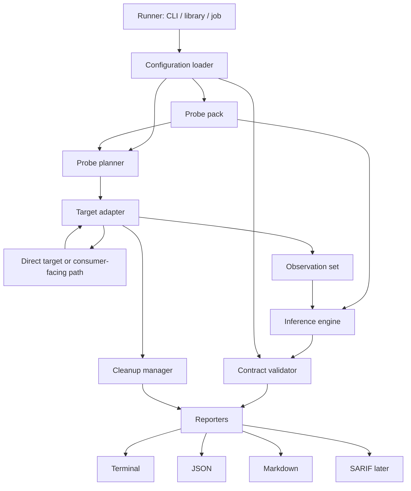
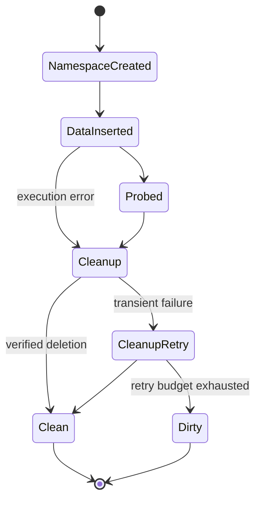
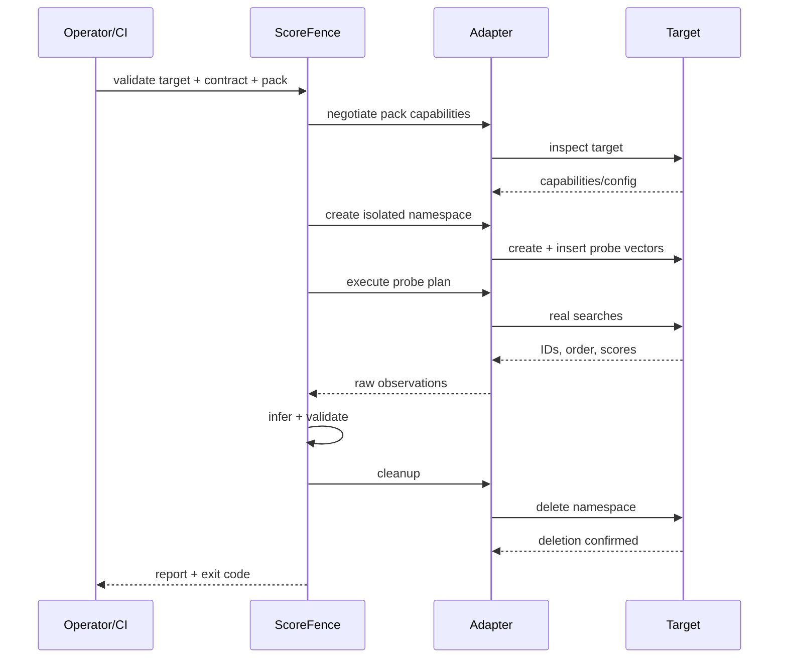

# Architecture

## Design goals

ScoreFence must be:

- **out-of-band** — it must not sit in the production request path;
- **backend-agnostic** — adapters must be separated from rules;
- **deterministic** — direct vectors and exact search are preferred;
- **safe** — it operates in an isolated temporary namespace;
- **explainable** — every verdict includes evidence;
- **CI-friendly** — exit codes and the JSON schema are stable;
- **extensible** — adding a backend does not require rewriting the inference engine;
- **score-family explicit** — vector assumptions never leak into unrelated score types;
- **stage-aware** — every observation identifies the boundary and ranking stage that produced it.

## Architectural boundaries

ScoreFence has four independent extension axes:

| Boundary | Responsibility | Must not do |
|---|---|---|
| Core | contracts, observations, comparison, findings, confidence, reports | import a target SDK or assume a score family |
| Probe pack | controlled fixtures, expected relations, tolerances, required capabilities | manage credentials or target transport |
| Target adapter | transport, field mapping, fixture lifecycle, raw observations | decide whether a score is good or normalize it silently |
| Runner | configuration, scheduling, credentials, artifacts, exit policy | change inference semantics |

This separation prevents two opposite design failures: a core filled with target-specific exceptions and a supposedly universal validator that applies vector heuristics to arbitrary model outputs.

## Component model



## 1. Configuration loader

Responsible for:

- target connection;
- credential references;
- expected contract;
- probe mode;
- isolation policy;
- timeout and retry limits;
- report formats.

Secrets must not appear in the final report. Configuration should support environment references:

```yaml
auth:
  token_env: SCOREFENCE_TOKEN
```

## 2. Probe pack

A probe pack defines how ScoreFence obtains evidence for one family of ranked values. Its public contract is conceptually:

```text
pack_id()
required_capabilities()
build_fixture(run_id)
build_queries(fixture)
expected_relations(fixture)
evaluate(observations, tolerances)
limitations()
```

The pack produces relations rather than target-specific absolute values whenever possible:

```yaml
expected_relations:
  - exact better_than near
  - near better_than far
  - exact accepted_by threshold
  - far rejected_by threshold
```

The MVP provides one pack, `vector_retrieval`. It uses direct vectors and known metric relationships to test distance, similarity, ordering, threshold polarity, and metric compatibility.

Future packs may cover rerankers, recommendation rankings, anomaly scores, or risk scores only when they provide suitable controlled fixtures and honest limitations. Adding a pack does not imply that values from different packs share a range or can be compared.

## 3. Probe planner

Selects the smallest probe set required to answer the given question.

For example:

- validating direction requires only identity, near, and far probes;
- distinguishing cosine from dot product requires a scaled vector;
- validating a threshold requires the path that actually applies the filter;
- migration comparison fixes the same plan for both targets.

The planner must not run extra probes “just in case”: fewer operations mean a smaller risk surface and a clearer report.

## 4. Target adapter

An adapter implements backend-specific operations:

```text
capabilities()
prepare_probe_scope()
load_probe_fixture()
execute_probe_query()
execute_thresholded_query()
inspect_target()
cleanup_probe_scope()
```

### Capability declaration

```yaml
supports:
  controlled_records: true
  direct_vector_queries: true
  exact_search: true
  isolated_scope: true
  server_side_threshold: false
  metric_introspection: true
```

The inference engine depends on capabilities, not on the adapter type.

`prepare_probe_scope` and `cleanup_probe_scope` are lifecycle abstractions. The vector-retrieval pack may implement them as a temporary collection or namespace. A stateless model endpoint may use an in-memory fixture and return a no-op cleanup handle. The pack decides which capabilities are sufficient; the adapter only exposes them.

### Two target classes

A **direct adapter** talks to a target through its public API or SDK. It localizes the semantics of the score producer.

A **pipeline adapter** invokes the same consumer-facing API used by the production application. It validates end-to-end preservation of semantics across wrappers, services, and filters.

Comparing native and pipeline observations identifies the layer where an inversion was introduced.

## 5. Observation set

The adapter returns raw evidence without interpreting it:

```json
{
  "pack_id": "vector_retrieval/v1alpha1",
  "boundary_id": "consumer_api",
  "score_stage": "vector_search",
  "query_id": "q",
  "returned": [
    {"probe_id": "exact", "position": 1, "value": 0.0},
    {"probe_id": "near", "position": 2, "value": 0.2},
    {"probe_id": "orthogonal", "position": 3, "value": 1.0}
  ],
  "threshold": {
    "configured": 0.3,
    "accepted": ["orthogonal"]
  }
}
```

Raw observations must be preserved in the report so inference can be reviewed manually.

An observation never states that a value is distance, similarity, relevance, or probability. It records only what happened. Meaning is established by the pack evaluator and compared with the declared contract.

## 6. Contract model

A contract is stage-specific and boundary-specific:

```yaml
contract:
  contract_id: catalog-candidate-search
  pack: vector_retrieval/v1alpha1
  boundary: consumer_api
  score_stage: vector_search
  metric: cosine
  value_kind: similarity
  better_when: higher
  result_order: descending
  expected_range: [-1.0, 1.0]
  threshold:
    operator: gte
    value: 0.75
```

The core treats fields such as `metric`, `value_kind`, and `expected_range` as typed properties defined by the selected pack. Generic properties such as `boundary`, `score_stage`, `better_when`, `result_order`, and threshold behavior remain available to every ranked-score contract.

Two contracts may describe different stages of one pipeline. Their numeric values are not comparable unless an explicit transformation contract says they are.

## 7. Inference engine

The inference engine combines generic relation checks with pack-specific evaluators. For the vector-retrieval pack it:

- calculates expected metric values;
- matches them to observations;
- determines direction;
- evaluates candidate metric fingerprints;
- measures ordering stability;
- assigns confidence;
- preserves alternative compatible explanations.

It knows nothing about credentials, HTTP, cleanup, or target product names. It also refuses to execute a pack when required capabilities are absent.

## 8. Contract validator

The validator compares inferred behavior with the declared contract and runs rules:

```text
SF101 direction mismatch
SF102 result-order mismatch
SF103 threshold-polarity mismatch
SF104 exact-match rejection
SF105 metric-fingerprint mismatch
SF106 score-stage ambiguity
SF201 unstable ordering
SF301 unsafe probe isolation
SF302 incomplete cleanup
```

Every finding contains:

- severity;
- a short message;
- expected behavior;
- observed evidence;
- confidence;
- suggested remediation;
- references to probe IDs.

## 9. Cleanup manager

Cleanup is part of correctness, not an auxiliary operation.



If cleanup cannot be confirmed, the final report must contain a separate finding and the namespace ID.

## 10. Reporters

### Terminal

For humans and CI logs. It should be concise by default and detailed with `--verbose`.

### JSON

A stable, versioned schema for CI, automation, dashboards, and any external system.

### Markdown

For CI summaries, issue trackers, and migration reviews.

### SARIF

Not required for the MVP. It may allow findings to appear in code-scanning interfaces.

## Execution flow



## Exit codes

Proposed contract:

| Code | Meaning |
|---:|---|
| `0` | PASS; informational findings are allowed |
| `1` | WARN when strict mode is enabled |
| `2` | Contract FAIL |
| `3` | INCONCLUSIVE or environment error |
| `4` | Unsafe cleanup or isolation failure |
| `64` | Invalid configuration |

## Suggested implementation layout

```text
src/scorefence/
├── cli.py
├── config.py
├── contracts.py
├── probes/
│   ├── planner.py
│   └── lifecycle.py
├── packs/
│   ├── base.py
│   └── vector_retrieval/
│       ├── fixture.py
│       ├── relations.py
│       └── evaluator.py
├── adapters/
│   ├── base.py
│   ├── in_memory.py
│   └── generic_http.py
├── inference/
│   ├── direction.py
│   ├── relations.py
│   └── confidence.py
├── rules/
│   ├── base.py
│   └── builtin.py
├── reporting/
│   ├── terminal.py
│   ├── json.py
│   └── markdown.py
└── cleanup.py
```

## Deployment model

The MVP runs as an ephemeral CLI job:

- on a developer laptop;
- in a CI runner;
- as an orchestrator job;
- as a background task in any control plane.

ScoreFence must not become an always-on proxy. A permanent component would increase latency and security surface without necessity.

The runner may be integrated into any control plane, but the control plane supplies only configuration, temporary credentials, scheduling, and artifact storage. It does not own probe semantics or findings.
