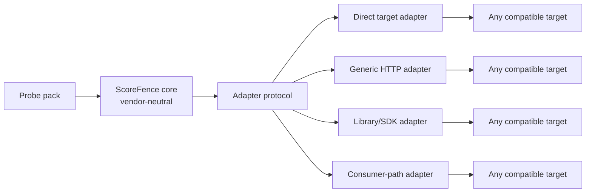

# Universal integration patterns

## Independence principle

ScoreFence is a standalone contract-testing engine. It is not a module of a particular AI platform, gateway, vector database, framework, or cloud provider.

Independence is enforced through four boundaries:

1. **Core** knows only probes, observations, contracts, rules, and reports.
2. **Probe pack** defines controlled fixtures and expected relations for one score family.
3. **Adapter** translates ScoreFence operations into the API of a target.
4. **Runner** decides where validation executes: locally, in CI, as a container job, through a scheduler, or from an external control plane.



Changing the target or execution environment must not change the inference engine.

## Integration fit

An integration is valuable when the score crosses at least one independently implemented boundary and downstream behavior depends on it:

```text
target → SDK/adapter → internal service → public API → threshold/ranker → consumer
```

ScoreFence may validate one boundary or compare several boundaries. Common integration goals are:

| Goal | Targets | Expected artifact |
|---|---|---|
| Adapter conformance | native target and adapter output | one approved consumer contract |
| Target onboarding | newly configured target path | initial contract fingerprint |
| Migration safety | baseline and candidate paths | semantic diff before cutover |
| Release regression | approved and candidate versions | CI verdict plus evidence |
| Stage provenance | vector, fusion, reranker, final ranking | separate stage contracts |
| Incident localization | direct and consumer-facing paths | first boundary with contradictory observations |

Detailed application examples are documented in [application areas and use cases](USE_CASES.md).

## Public adapter protocol

A minimal adapter implements:

```text
capabilities()
prepare_probe_scope(run_id, fixture)
load_probe_fixture(scope, fixture)
execute_probe_query(scope, query, options)
execute_thresholded_query(scope, query, threshold)
cleanup_probe_scope(scope)
```

Optional capabilities are declared explicitly:

```yaml
capabilities:
  controlled_records: true
  direct_vector_queries: true
  exact_search: true
  isolated_scope: true
  server_side_threshold: false
  metric_introspection: false
```

An adapter returns universal observations:

```json
{
  "pack_id": "vector_retrieval/v1alpha1",
  "boundary_id": "consumer_api",
  "score_stage": "vector_search",
  "query_id": "identity",
  "results": [
    {"probe_id": "exact", "position": 1, "value": 0.0},
    {"probe_id": "near", "position": 2, "value": 0.2}
  ]
}
```

It must not decide by itself whether a score is distance, similarity, relevance, probability, or risk. That responsibility belongs to the selected probe pack and inference engine.

The scope handle is intentionally abstract. A stored-vector target may return a temporary namespace; a stateless endpoint may return an in-memory or no-op handle. Required lifecycle behavior is negotiated from the probe pack's capabilities.

## Pattern 1: standalone CLI

The simplest execution mode is:

```bash
scorefence validate --config scorefence.yaml
```

The CLI:

1. loads an adapter plugin;
2. loads the selected probe pack;
3. negotiates capabilities;
4. creates an isolated namespace;
5. executes the probe plan;
6. builds a report;
7. verifies cleanup;
8. returns a stable exit code.

This mode fits developer workstations, diagnostics, and one-time migration checks.

## Pattern 2: generic HTTP adapter

A generic HTTP adapter connects a target without changing the ScoreFence core. Configuration describes operation and field mappings:

```yaml
target:
  adapter: generic_http
  base_url: https://search.example.test
  auth:
    bearer_token_env: RETRIEVAL_TOKEN
  operations:
    create_namespace:
      method: POST
      path: /test-namespaces
    upsert:
      method: POST
      path: /test-namespaces/{namespace}/items
    search:
      method: POST
      path: /test-namespaces/{namespace}/search
    delete_namespace:
      method: DELETE
      path: /test-namespaces/{namespace}
  response_mapping:
    results_path: results
    id_field: id
    score_field: score
probe:
  pack: vector_retrieval/v1alpha1
  score_stage: vector_search
```

If the lifecycle cannot be described safely, use a small external adapter plugin instead of making the generic mapping more complex.

## Pattern 3: direct vs pipeline

The same probe plan runs through two adapters:

```text
direct adapter   → search backend
pipeline adapter → consumer-facing retrieval endpoint
```

The comparison identifies where semantics changed:

- the backend already returns an unexpected value;
- an SDK transformed the score;
- a wrapper reordered results;
- a threshold filter used the opposite operator;
- a reranker overwrote the field without changing `score_stage`.

Both sides implement the same protocol; ScoreFence does not know the pipeline’s technology stack.

## Pattern 4: library embedding

A Python application can execute the engine as a library:

```python
from scorefence import Contract, ProbeRunner

result = ProbeRunner(adapter=my_adapter).validate(
    contract=Contract.from_file("retrieval-contract.yaml")
)

if result.failed:
    raise RuntimeError(result.summary)
```

`my_adapter` may live in the application, in a separate package, or in a community plugin. The core does not import application models.

## Pattern 5: CI check

ScoreFence should run after changes to:

- the search backend version;
- an adapter or SDK;
- metric or index configuration;
- an embedding or encoder version;
- sorting and filtering code;
- a reranker or fusion stage.

It should also run before activating an externally managed target and before switching traffic during a migration. The check is event-driven: ScoreFence does not need to process every production request.

A neutral CI step:

```yaml
- name: Validate retrieval score contract
  run: scorefence validate --config ci/scorefence.yaml --format json,markdown
```

CI receives only an exit code and artifacts. ScoreFence requires no particular CI provider.

## Pattern 6: scheduled drift check

A scheduler periodically executes the same immutable probe plan and compares the fingerprint:

```text
last verified fingerprint
          ↓ compare
current observed fingerprint
          ↓
unchanged / drifted / inconclusive
```

The scheduler may be cron, a container platform, a workflow engine, or an existing control-plane feature. That is a deployment choice, not part of the core.

## End-to-end: connecting a new target

### 1. Select an adapter

First determine whether the generic HTTP adapter is sufficient. A custom plugin is required only for specialized lifecycle, transport, or authentication behavior.

### 2. Declare the expected contract

```yaml
contract:
  pack: vector_retrieval/v1alpha1
  boundary: consumer_api
  score_stage: vector_search
  metric: cosine
  value_kind: distance
  better_when: lower
  result_order: ascending
  threshold:
    operator: lte
    value: 0.30
```

### 3. Negotiate capabilities

The runner discovers whether direct vectors, exact search, and isolated namespaces are available. A missing critical capability produces `INCONCLUSIVE`, not a guess.

### 4. Execute in isolation

Probe records exist only in a temporary namespace. Customer data is neither read nor used as a test dataset.

### 5. Validate and clean up

The inference engine compares observations with the contract. Cleanup runs independently of the verdict and is verified separately.

### 6. Produce a portable result

```json
{
  "schema_version": "v1alpha1",
  "target_id": "candidate-search",
  "adapter_protocol": "v1alpha1",
  "pack_id": "vector_retrieval/v1alpha1",
  "boundary_id": "consumer_api",
  "score_stage": "vector_search",
  "observed_contract": {
    "value_kind": "distance",
    "better_when": "lower",
    "result_order": "ascending"
  },
  "verdict": "pass",
  "cleanup": "verified"
}
```

The report schema contains no vendor-specific fields. An adapter may attach namespaced metadata that the core preserves but does not interpret.

## Packaging adapters

Proposed discovery convention:

```text
Python entry point group: scorefence.adapters
Adapter protocol version: scorefence.adapter/v1alpha1
Configuration key: adapter: package_name.adapter_name
```

A community adapter passes a compatibility suite that validates:

- capability declaration;
- deterministic observation shape;
- idempotent cleanup;
- secret redaction;
- correct behavior under partial failure;
- absence of hidden score normalization.

## Execution models

| Model | When to use it | Platform dependency |
|---|---|---|
| Local CLI | Development and diagnostics | None |
| CI job | Change validation | None; only a shell or container runner is required |
| Scheduled container | Drift monitoring | None; any scheduler works |
| Embedded library | Validation inside an application | Only the adapter implemented by the application |
| External control plane | Centralized management | Integration through JSON reports and exit status |

## What must never enter the core

- vendor-specific API clients;
- platform organization or project models;
- fixed endpoint paths;
- assumptions about collection or index names;
- cloud-specific credential discovery;
- automatic normalization based on a product name;
- UI-specific status storage;
- dependency on a particular orchestration system.
- vector assumptions for score families owned by another probe pack.

Such logic belongs in an adapter plugin or external runner.

## Optional integration with external platforms

Any platform may execute ScoreFence as a subprocess, container job, or library call and consume the versioned JSON report. This does not make that platform a required part of the project.

The recommended boundary is:

```text
External system
   ├── supplies config and temporary credentials
   ├── starts ScoreFence
   └── consumes report and exit code

ScoreFence
   ├── owns probe execution
   ├── owns inference and findings
   └── never imports external product models
```

## Conclusion

ScoreFence universality is defined by the stability of its small adapter protocol, not by the number of built-in integrations. The core must work identically with a local mock, search database, HTTP retrieval service, application wrapper, and complex multi-stage pipeline.

Universality does not mean pretending every score has the same semantics. Targets are generalized through adapters; score families are generalized through explicit probe packs; deployment is generalized through runners. Each boundary stays small, typed, and independently testable.
