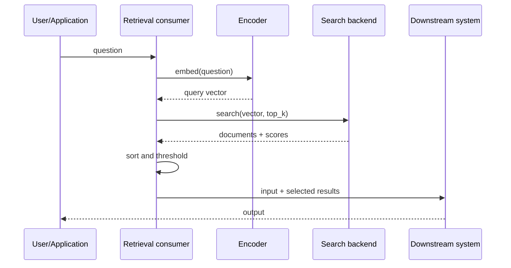

# ScoreFence theory

This document explains ScoreFence from first principles: what breaks in retrieval systems, why ordinary tests miss it, what synthetic probes can prove, and where the tool’s capabilities end. The approach applies equally to vector, semantic, hybrid, and application-specific search paths.

## 1. The shortest formulation

A search backend and its consumer exchange a number. Both may call it `score` while assigning opposite meanings to it.

ScoreFence validates four questions:

1. What does the returned number mean?
2. Does a larger or smaller number represent a better result?
3. Are results returned in the correct order?
4. Is the threshold applied correctly?

If even one answer is wrong, a consumer can silently select poor results.

## 2. Where the problem lives

A simplified retrieval pipeline looks like this:



ScoreFence focuses on this boundary:

```text
Search backend  ── items + numeric values ──►  Consumer
```

This is a narrow but critical contract. An error here propagates to everything downstream:

- the LLM receives irrelevant documents;
- relevant documents are discarded;
- the token budget is spent on noise;
- answers appear confident but rely on the wrong source;
- quality evaluation becomes unstable;
- a backend migration degrades the product without an explicit error.

### 2.1 The problem is not limited to one application type

The boundary exists anywhere a system retrieves or ranks candidates by vector distance or similarity:

| System shape | Possible candidates |
|---|---|
| Semantic search | documents, passages, messages, tickets |
| Catalog search | products, offers, categories |
| Recommendation retrieval | items passed to a later ranking model |
| Multimodal search | images, audio, video, code |
| Entity matching | possible duplicate or related records |
| Similar-case lookup | incidents, alerts, support cases |
| Multi-target gateway | results produced by interchangeable backends |

The business domain changes, but the technical risk is the same: a producer emits a ranked numeric value and a consumer applies assumptions that the type system and response schema do not express.

### 2.2 The boundary test

ScoreFence is useful when the score crosses an independently implemented boundary and affects sorting, filtering, top-k selection, or a decision threshold. It becomes especially valuable when backends, adapters, SDKs, or ranking stages can change independently while the external schema stays stable.

If one in-process function computes and consumes the value under a complete unit test, there may be no integration contract for ScoreFence to validate.

## 3. Why the name `score` guarantees nothing

Consider this result:

```json
[
  { "id": "A", "score": 0.08 },
  { "id": "B", "score": 0.76 }
]
```

You cannot know which document is better until the semantics are known.

### Variant A: similarity

The number represents similarity. Usually:

```text
higher score = better match
```

Document `B` is better.

### Variant B: distance

The number represents distance. Usually:

```text
lower score = better match
```

Document `A` is better.

### Variant C: transformed value

The backend or wrapper may have computed:

```text
similarity = 1 - cosine_distance
```

or:

```text
relevance = 1 / (1 + euclidean_distance)
```

or an arbitrary normalization. Direction may be preserved while the range and threshold meaning change.

### Variant D: negative inner product

Some implementations expose a negative inner product so a nearest-neighbor index can sort all values under one convention. An external application may mistake this technical operator result for positive similarity.

### Variant E: score after reranking

A primary vector score may be replaced by a cross-encoder score. Both fields may be named `score` even though they belong to different stages and have incomparable ranges.

## 4. Minimum mathematics

ScoreFence does not require users to be mathematicians, but the fundamentals matter.

Let `x` and `y` be two vectors.

### 4.1 Cosine similarity

Cosine similarity compares direction:

```text
cos_sim(x, y) = (x · y) / (||x|| × ||y||)
```

A typical range is:

```text
[-1, 1]
```

For non-zero vectors:

- `1` — the same direction;
- `0` — orthogonal directions;
- `-1` — opposite directions.

Larger is usually better.

### 4.2 Cosine distance

A common definition is:

```text
cos_distance(x, y) = 1 - cos_sim(x, y)
```

A typical range is:

```text
[0, 2]
```

Smaller is better.

Therefore, similarity `0.8` and distance `0.2` may describe the same vector pair.

### 4.3 Euclidean distance

This is ordinary geometric distance:

```text
L2(x, y) = sqrt(sum((x_i - y_i)^2))
```

Its minimum is `0`; in general, it has no fixed upper bound. Smaller is better.

### 4.4 Dot product

```text
dot(x, y) = sum(x_i × y_i)
```

Larger is usually better, but the result depends on both direction and vector length. Dot product and cosine similarity therefore agree in meaning only under specific conditions, such as normalized vectors.

## 5. Deterministic probe dataset

The most reliable ScoreFence mode does not use text or an embedding API. It writes direct vectors whose relationships are known in advance.

```text
query       q = ( 1.0, 0.0 )
exact       e = ( 1.0, 0.0 )
near        n = ( 0.8, 0.6 )
orthogonal  o = ( 0.0, 1.0 )
opposite    p = (-1.0, 0.0 )
scaled      s = ( 2.0, 0.0 )
```

The first five unit vectors produce this picture:

| Candidate | Cosine similarity | Cosine distance | L2 distance | Dot product |
|---|---:|---:|---:|---:|
| `e=(1,0)` | 1.0 | 0.0 | 0.0 | 1.0 |
| `n=(0.8,0.6)` | 0.8 | 0.2 | ≈0.632 | 0.8 |
| `o=(0,1)` | 0.0 | 1.0 | ≈1.414 | 0.0 |
| `p=(-1,0)` | -1.0 | 2.0 | 2.0 | -1.0 |

`s=(2,0)` helps distinguish metrics:

| Pair `q` vs `s` | Value |
|---|---:|
| Cosine similarity | 1.0 |
| Cosine distance | 0.0 |
| L2 distance | 1.0 |
| Dot product | 2.0 |

This is a metric fingerprint: one result is insufficient, while a set of carefully chosen pairs narrows the possible semantics.

## 6. Which invariants are checked

### 6.1 Identity invariant

If a query vector is literally equal to a stored vector, the exact match must have an optimal or near-optimal value.

A violation may indicate:

- the wrong metric;
- different normalization for query and indexed vectors;
- search against the wrong vector field;
- an enabled reranker;
- approximate search with extremely poor parameters;
- an adapter defect.

### 6.2 Semantic ordering invariant

The expected semantic order is:

```text
exact → near → orthogonal → opposite
```

Numbers may increase or decrease, but semantic order must not be reversed.

### 6.3 Direction invariant

If better candidates receive smaller values:

```yaml
better_when: lower
```

If they receive larger values:

```yaml
better_when: higher
```

Direction is a separate property. It must not be inferred from a field name such as `score` or `distance`.

### 6.4 Result-order invariant

A backend may return correct values in the wrong order, and a wrapper may sort them again. ScoreFence validates separately:

- score semantics;
- actual output order;
- declared order.

### 6.5 Threshold-polarity invariant

For similarity, the common rule is:

```text
accept if score >= threshold
```

For distance:

```text
accept if score <= threshold
```

The most dangerous defect looks plausible:

```python
relevant = [item for item in results if item.score >= 0.7]
```

The code is syntactically correct. If `score` is distance, it systematically selects distant documents.

### 6.6 Range invariant

Range helps detect transformations but is rarely sufficient by itself.

For example, a value in `[0,1]` may be:

- cosine similarity on a particular dataset;
- normalized distance;
- probability-like reranker output;
- an arbitrary relevance function.

ScoreFence therefore uses range only as supporting evidence.

## 7. Contract declaration

A complete contract should look roughly like this:

```yaml
metric: cosine
value_kind: distance
better_when: lower
result_order: ascending
expected_range:
  min: 0.0
  max: 2.0
threshold:
  operator: lte
  value: 0.3
score_stage: vector_search
normalization:
  query: l2
  stored: l2
```

### Why both `metric` and `value_kind` are needed

`metric: cosine` does not say whether the system returns cosine similarity or cosine distance. These must be separate fields.

### Why `score_stage` is needed

After reranking, a score may mean something different. The contract must explicitly identify whether a value belongs to:

- vector search;
- hybrid fusion;
- a reranker;
- final business ranking.

### Why the threshold operator is needed

The value `0.7` alone is insufficient. Both the value and operation are required:

```yaml
operator: gte
value: 0.7
```

## 8. Discovery and validation are different tasks

### Validation

An expected contract exists, and ScoreFence checks conformance:

```text
expected: lower_is_better
observed: higher_is_better
verdict: FAIL
```

This is a strong mode because the success criterion is known in advance.

### Discovery

No contract exists, so ScoreFence tries to infer the most likely semantics:

```text
observed behavior is compatible with:
  - cosine distance
  - normalized angular distance

better_when: lower, confidence 0.99
exact metric: inconclusive
```

Discovery must preserve uncertainty. It must not declare an exact metric when probes prove only direction.

## 9. Graded confidence

ScoreFence must not present every hypothesis as fact.

Proposed scale:

| Confidence | Basis |
|---|---|
| `verified` | Direct vectors, exact search, and an unambiguously confirmed contract |
| `strong` | Direct vectors, but an approximate index or wrapper permits minor error |
| `moderate` | Text probes through an embedding model with stable ordering |
| `weak` | Too few results or multiple semantics fit the observations |
| `inconclusive` | Isolation, insertion, search, or cleanup prevents a conclusion |

A numeric confidence may be useful in JSON, but the user-facing verdict must explain its basis.

## 10. Verdicts

### PASS

Observed behavior confirms the declared contract.

### WARN

The primary contract works, but a risk was detected:

- score range is unstable;
- approximate search occasionally reorders close candidates;
- the backend hides metric configuration;
- cleanup completed only after a retry;
- some probes are unavailable.

### FAIL

A reproducible contradiction was found:

- direction mismatch;
- inverted threshold;
- incorrect ordering;
- exact match was discarded;
- the pipeline transformed a score without declaring a new stage.

### INCONCLUSIVE

ScoreFence cannot make a safe conclusion. This is neither PASS nor FAIL.

Reasons include:

- an isolated namespace cannot be created;
- the backend does not accept direct vectors;
- filters hide some probes;
- results are non-deterministic;
- credentials allow search but not cleanup.

## 11. Why unit tests are insufficient

A unit test often validates a mock:

```python
mock_search.return_value = [
    {"id": "a", "score": 0.91},
    {"id": "b", "score": 0.72},
]
```

The mock already contains its author’s assumption: larger is better. It does not test the real backend, SDK, operator, or wrapper.

ScoreFence is a contract or integration test:

- it writes known vectors;
- it traverses the real API path;
- it receives real numbers;
- it validates consumer behavior.

## 12. Why backend documentation is insufficient

Even accurate documentation describes only one layer. Between a search backend and its consumer there may be:

- an SDK;
- an adapter;
- a REST controller;
- a schema serializer;
- a generic `score` field;
- middleware or a proxy;
- a reranker;
- a threshold filter.

Any layer can transform the value or lose metadata. Official documentation from different search engines demonstrates both approaches: some APIs expose distance operators, others expose similarity, and migration guides warn about possible score inversion. This confirms that the problem lies in the integration contract, not in one “incorrect” implementation.

## 13. Approximate nearest-neighbor search

HNSW and other ANN indexes do not always return the mathematically perfect top-k. ScoreFence must account for this.

Good probe rules include:

- use a small collection;
- enable exact search when the backend supports it;
- choose vectors with a large separation margin;
- do not treat a swap between nearly equal candidates as an automatic FAIL;
- repeat the probe several times;
- report ordering stability separately.

ScoreFence validates the score contract; it does not claim to prove perfect ANN recall.

## 14. Text probes

If the backend does not allow direct-vector insertion, text can be used:

```text
query:  "How do I reset my password?"
exact:  "How do I reset my password?"
near:   "Steps for changing an account password"
far:    "Quarterly office catering schedule"
```

Text probes are weaker because:

- the embedding model may be updated;
- similarity depends on language and model;
- an exact string may not preserve identity after preprocessing;
- remote embeddings may drift by model version;
- the precise metric cannot be inferred reliably.

Text mode should therefore produce `moderate` confidence and validate primarily ordering and direction.

## 15. Hybrid search and reranking

A hybrid pipeline may combine dense score, BM25, and business signals. In that case, the entire path cannot be validated under one contract.

The correct model is:

```text
vector_score contract
      ↓
sparse_score contract
      ↓
fusion_score contract
      ↓
reranker_score contract
      ↓
final ranking contract
```

The ScoreFence MVP validates one stage per run. The report must always include `score_stage`.

This is also the boundary between the core and probe packs. The `vector_retrieval` pack can validate the vector stage deterministically. A reranker or recommendation model needs a separate pack with controlled query-item fixtures, expected relations, tolerances, and explicit limitations. Reusing vector probes for an unrelated score family would create false confidence.

## 16. A threshold cannot be transferred automatically

Even when two systems return higher-is-better similarity, threshold `0.7` may mean something different because of:

- a different metric;
- normalization;
- the embedding model;
- quantization;
- approximation;
- score transformation;
- corpus distribution.

ScoreFence can prove that an operator is inverted. It must not automatically claim that a particular threshold value is optimal for business relevance.

Threshold selection is a separate task that requires a labeled dataset.

## 17. Failure scenarios

### Scenario A: inverted threshold

The backend returns cosine distance. The consumer keeps `score >= 0.7`. Distant items pass while close ones are discarded.

ScoreFence detects this deterministically.

### Scenario B: Backend A → Backend B migration

The team preserves the old `score` field, but the new backend returns different semantics. The API schema does not change, and compilation and unit tests pass.

ScoreFence compare exposes a change from `lower_is_better` to `higher_is_better` before cutover. It validates observed behavior, so the tool does not need to know the producer of either the source or destination system.

### Scenario C: a wrapper normalized the score

The backend distance is correct, but an adapter converts it into `[0,1]` relevance. The consumer still uses a threshold from the old scale.

ScoreFence records that direction was preserved while value kind or range drifted.

### Scenario D: a reranker overwrote the field

Vector search returns distance, and a reranker writes relevance into the same field. Observability exposes one name without stage provenance.

ScoreFence requires stage-specific contracts or returns `INCONCLUSIVE` for the mixed path.

### Scenario E: search uses the wrong field

A collection contains multiple named vectors. The adapter accidentally uses an old embedding field.

Identity and ordering probes fail even though the metric and threshold appear correct.

## 18. What ScoreFence proves and does not prove

### It can prove

- observed score direction;
- ordering compatibility with known vectors;
- threshold polarity;
- preservation of score semantics across an integration path;
- drift between two versions;
- cleanup and probe-execution isolation.

### It can only infer

- the exact metric when the backend hides configuration;
- normalization;
- the existence of an additional transformation;
- causes of ANN instability.

### It does not prove

- that retrieved documents are useful to the user;
- that the embedding model fits the domain;
- that the LLM will produce a correct answer;
- that the production threshold is optimal;
- that the system is protected from prompt injection;
- that recall and precision meet business KPIs.

### Support for other numeric scores

Direction, order, threshold, and provenance are generic contract concepts, but the evidence needed to validate them is domain-specific. A vector pack can derive exact relations from mathematics. A reranker, anomaly detector, recommendation model, or risk model needs controlled domain fixtures whose expected relative behavior is justified independently.

Therefore, ScoreFence may grow beyond vector retrieval through explicit probe packs, but the MVP must not claim that every numeric model output is supported. A field is validatable only when the selected pack can state what evidence would confirm or contradict its contract.

## 19. The main design principle

> Never silently normalize an unknown value.

A poor library sees a `score` field, assumes a `[0,1]` range, and automatically turns it into relevance.

ScoreFence must:

1. observe;
2. validate invariants;
3. expose uncertainty;
4. require an explicit contract;
5. never change production policy without confirmation.

## 20. Practical conclusion

ScoreFence is not needed because cosine distance is mathematically difficult. It is needed because modern retrieval and ranking systems are assembled from replaceable components, each with a locally reasonable API, while the shared meaning of a number is lost at their boundaries.

The tool turns an implicit assumption:

```text
"this score probably means relevance"
```

into a verifiable contract:

```text
"at this stage the value is cosine distance,
lower means better, output is ascending,
and the filter must use <="
```

This small guarantee applies to document search, catalog search, recommendation candidate generation, multimodal similarity, entity matching, and other retrieval paths with the same boundary shape. It makes those systems more explainable, safer to migrate, and cheaper to diagnose without pretending to replace relevance or model-quality evaluation.
